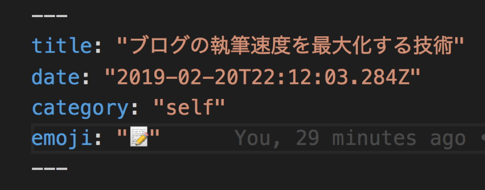
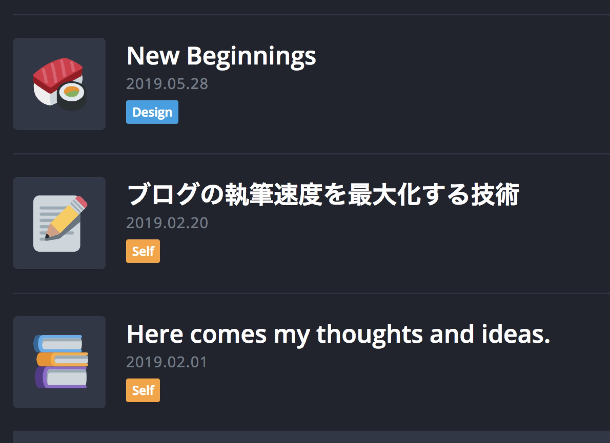

できる限り気軽に、速くブログを書きたい。WordPressやnoteは次の点で完璧ではない。

##### マークダウンで書きたい

エディターはマークダウンがベストだ。WordPressの新しいエディタではマークダウンで書くことができるが、もっとシンプルな書き心地が良い。

##### ブラウザで書きたくない

インターネットに接続することなく、テキストエディタ上で気楽に書き始めたい。インターネットに接続して逐一プレビューを見るのも億劫だ。

##### 変更履歴を明確に残したい

文章の変更履歴や推敲の履歴を残し、後から振り返られるようにしたい。

##### サムネイル画像なしでも華やかに見せたい

ブログの見栄えを良くしたいが、いちいちサムネイル画像を作ったり探したりするのは面倒だ。サムネイル画像なしでもメリハリのある華やかなデザインにしたい。

## 最高の執筆環境を実現するためにやったこと

このブログではこれらの問題を解決している。

### 1. マークダウンファイルで記事を書く

テキストエディタを使って、マークダウンファイルを編集する形で書いている。このブログはGatsby.jsで作られており、`gatsby develop`のコマンドを打てば、ファイル保存時に自動でブラウザに内容が反映されるようになる。
ブラウザを横に並べておけば、プレビューしながら記事を書くことが可能だ。

### 2. Gitで記事データを管理する

記事を書き終えたらマークダウンファイルをコミットし、GitHubへプッシュする。masterブランチにマージすれば実際のサイトに反映される（Netlifyで自動ビルド・デプロイされるようになっている）。

GitHubで記事データを管理すれば、変更履歴を視覚的に見ることができ、推敲や修正が最高に楽になる。
[[simple]]
| 僕が気に入ってるのは、他の人が誤字や何らかの誤りを見つけたときにプルリクを送ることができる点だ。例えばこの記事の内容も[GitHubにあげられている](https://github.com/catnose99/CatKnows/edit/master/content/blog/blazing-fast-writing/index.md)。このブログにそこまでしてくれる人はいないかもしれないが、ブログ全体がオープンな状態になっているのはとても気持ちが良い。

### 3. サムネイル画像なしでも華やかに

ブログの執筆と公開のハードルを極限まで下げたい。
僕の中でこれまでネックだと感じていたのがサムネイル画像だ。いちいち作るのは面倒だが、サムネイル画像のないブログはビジュアル的にメリハリをつけにくい。
そこで、このブログでは**絵文字を活用**することにした。

記事を作成するときに絵文字を1つ選ぶ。
[[imageSmall]]
| 

この絵文字が記事一覧や、記事ページのトップにアイキャッチ的に使用されるようにする。
[[imageMedium]]
| 

このブログはフラットなテイストにしたかったため、絵文字を[Twemoji](https://github.com/twitter/twemoji)（Twitterの絵文字）に変換する処理を加えている。
ネックだったサムネイル画像を作る手間がなくなり、執筆のハードルが大きく下がった。
僕は英語の記事もよくチェックしているが、このような手法を取っているブログは今のところ見たことがない。
新しい表現をするのはいつだってワクワクする。

---

現在ではほとんどのブログやWebメディアがWordPressにより作られている。たしかにWordPressは学習コストが低く、ネット上にたくさんのノウハウが落ちており、専門知識がなくてもカスタマイズがしやすく、プラグインによりやりたいことがほとんどできる、依然として最高のCMSだ。

しかし、Gatsby.jsを触っていると、カスタマイズの自由度やパフォーマンスに唸らせられる。
ブログのスタンダードが少しずつ変わっていくことを感じ、ワクワクするのである。
