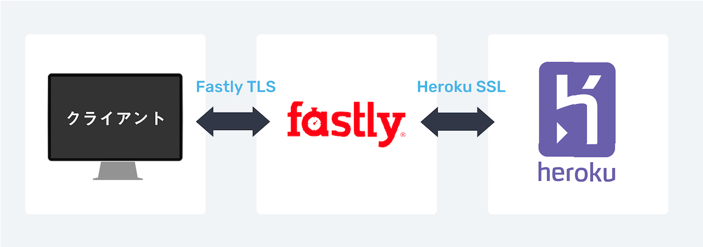
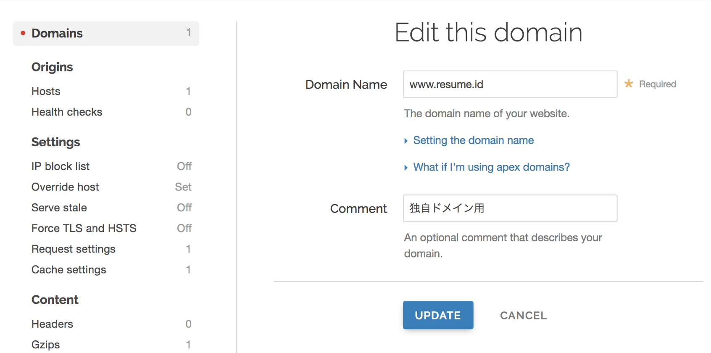
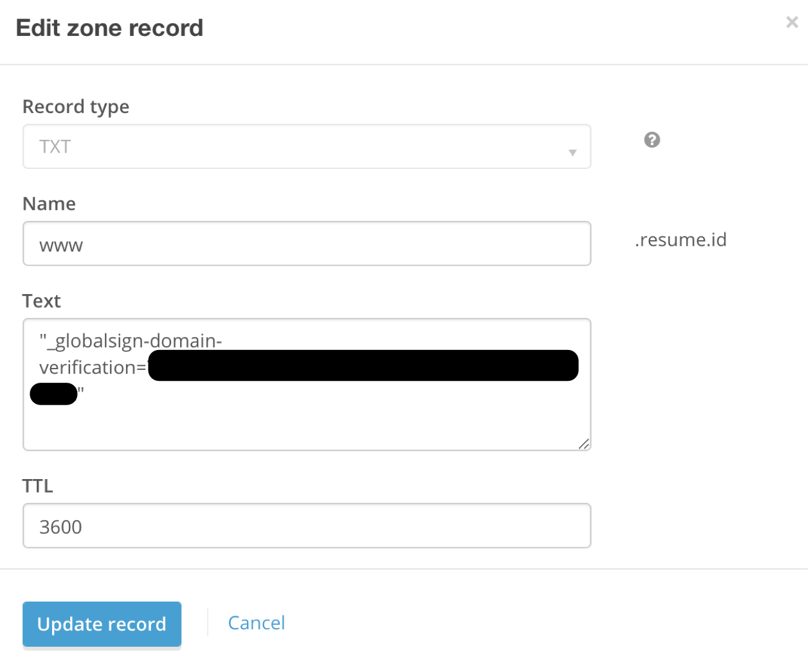
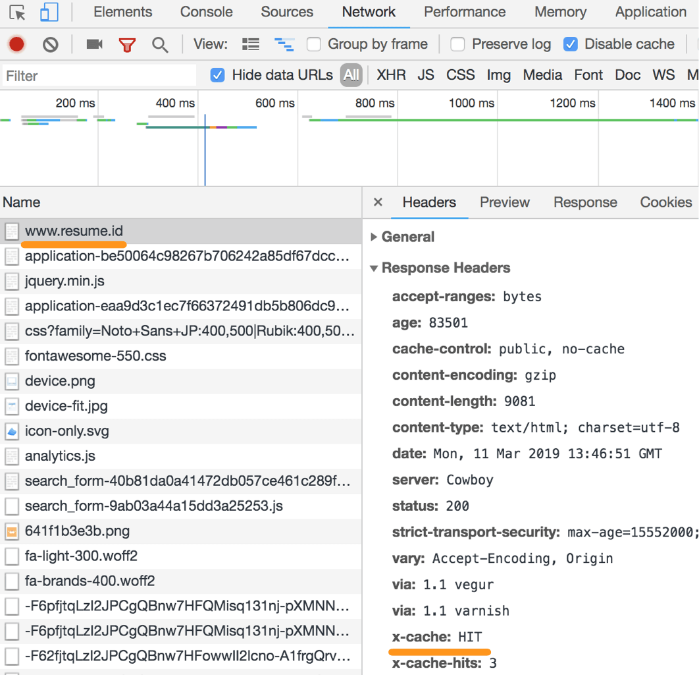

僕がつくったポートフォリオ作成サービス[RESUME](https://www.resume.id/)では、ページデータをFastlyにキャッシュさせています。CSSや画像などをキャッシュさせるのは簡単ですが、ページ自体をキャッシュしようとすると途端に難易度が上がります。

ページキャッシュに関してはインターネット上であまり知見が見つからなかったため、ここにまとめておこうと思います。

## RESUMEの技術スタック

前提としてRESUMEでは主に以下の技術・サービスを使っています。

- Ruby on rails
- Vue.js
- Heroku
- **Fastly**
- S3
- CloudFront

Fastlyにはページデータとサービスのアセット（CSSやサービス内で使われている画像など）をキャッシュさせ、S3/CloudFrontにはユーザーがアップロードした画像を保存しキャッシュしているという形です。

## なぜFastlyを使ったか

もともとはHerokuにデプロイしてページデータをキャッシュさせるつもりはありませんでした。しかし、いざHerokuにデプロイしてみると、どうしてもレスポンスの遅さが気になってしまいました（Herokuでは現在エンタープライズプランでしか国内リージョンを提供していません）。

そこで、爆速だと話題になった[Dev.to](https://dev.to/)を参考に、Fastlyでページデータごとキャッシュすることにしました。Fastlyにはキャッシュを即時削除する「インスタントパージ」という機能があるため、動的なページでもキャッシュしやすいのです。

## Dev.toの構成

Dev.toもRails + Heroku + Fastlyで構成されています。ほとんどのページをキャッシュし、CDN配信することが爆速に大きく寄与しています。Fastlyにキャッシュすることで、アセットやページデータのHTTP/2配信も可能になります。

## Rails + Fastlyでページキャッシュを実現する手順

さて、ここからが本題です。Rails + Fastly + Herokuでページキャッシュを実現するための方法を説明していきます。

### 1. HerokuでFastlyのアドオンを追加
まず、HerokuでFastlyのアドオンを追加します。

[[simple]]
| 👉 [**Fastly:Heroku Add-ons**](https://elements.heroku.com/addons/fastly)

アセットだけでなくページデータまでキャッシュするためには、Herokuとブラウザのやり取りの間に常にFastlyに入ってもらうことになります。
「ブラウザからFastlyにリクエストを投げ、FastlyがHerokuからデータを受け取る」という要領です。
キャッシュするページに限らず、すべてのリクエストをFastlyを通して行います。


ポイントは**クライアントとFastlyのやり取りにHerokuのSSLは使えない**ということです。ページをキャッシュするためにはFastlyで用意されたTLSを使う必要があります。ここで独自ドメインを使うためにはFastlyのTLSプランに入らなければなりません。


#### 独自ドメインを使うためにはTLSプランが必須
独自ドメインを使ってページごとキャッシュするにはHeroku FastlyアドオンのTLSプランに入らなければなりません。いちばん安いTLSプランでも**55ドル/月**（2019年3月時点）がかかります。これは避けようがありません。
[[simple]]
| 👉 [**Fastlyアドオンのプランと料金**](https://elements.heroku.com/addons/fastly#pricing)


### 2. Fastlyの管理画面で独自ドメインを追加
アドオンを追加したらFastlyの管理画面を開きます。
[[simple]]
|🚀Herokuアプリ管理画面の「Resources」タブの「Fastly」をクリックするとFastlyの管理画面が開きます

#### Domains設定
CONFIGUREタブから「Domains」⇒「CREATE DOMAIN」を選びます。

👆「Domains」に使用したい独自ドメインを追加します。コメントには自分が分かりやすいような文言を書いておきます。

#### Origins設定
次に「Origins」⇒「CREATE A HOST」を選びます。

👆このように設定します。**Name**には後から見て自分が分かりやすい名前をセットします。**Address**にはHerokuのアプリドメインを入力します。その他、このスクショと基本的に同じように設定すれば良いかと思います。


これでFastly管理画面での設定は一旦完了。「**Activate**」をクリックするとその設定が反映されるようになります。

### 3. 独自ドメインのTLS設定
次に独自ドメインのTLS設定を行います。この操作はFastlyのHeroku CLIプラグインから行います。
[[simple]]
| 👉 [**heroku-fastly:GitHub**](https://github.com/fastly/heroku-fastly)
このリポジトリのREADMEに書かれている通りにやれば設定は完了します。

#### FastlyのHeroku CLIプラグインをインストール
```
heroku plugins:install @fastly/heroku-plugin
```

#### カスタムドメインを登録
```
heroku fastly:tls www.example.com --app my-heroku-app
```
「登録が完了するまでに数分かかるので、その間にTXTレコードを作成してね」というメッセージが表示されます。
`globalsign-domain-verification=xxxxxxxx`という行がTXTレコードの値になります。

#### TXTレコードを作成
僕の場合は、Herokuの[PointDNSアドオン](https://devcenter.heroku.com/articles/pointdns)に以下のように登録しました。
[[imageMedium]]
|

#### 認証を行う
TXTレコードを作成したら次のコマンドで認証を行います。
```
heroku fastly:verify start www.example.com --app my-heroku-app
```
すると「wwwドメイン」か「apexドメイン（wwwなしのドメイン）」か聞かれます。
[[simple]]
|Fastlyはwwwドメインを推奨しており、apexドメインを使用するためには別手続きが必要です。詳しくは「[Using Fastly with apex domains](https://docs.fastly.com/guides/basic-configuration/using-fastly-with-apex-domains)」をチェックしてみてください。

認証が完了するまでしばらく時間がかかります（僕の場合たしか30分くらいかかりました）。

#### CNAMEを追加
以下のコマンドで認証のステータスをチェックできます。
```
heroku fastly:verify status www.example.com --app my-heroku-app
```
完了している場合にはCNAMEの値が返ってくるので、こちらもPointDNSに追加します。
[[simple]]
|後日談ですが、ページデータがHTTP2で配信されていなかったのでFastlyに問い合わせたところ「CNAMEの値を`http2.a.heroku.ssl.fastly.net`に変えたらHTTP2で配信されるよ」とのことでした

#### Done
ドメインの設定は以上で完了です。

--------

### 4. Railsでキャッシュするページの設定を行う
#### Fastlyでキャッシュされる条件
Fastlyでは以下の条件にマッチしたページのみキャッシュされます（[参考：FastlyサーバーのTTLの選択ロジック
](https://support.fastly.com/hc/en-us/community/posts/360040167351-Fastly%E3%82%B5%E3%83%BC%E3%83%90%E3%83%BC%E3%81%AETTL%E3%81%AE%E9%81%B8%E6%8A%9E%E3%83%AD%E3%82%B8%E3%83%83%E3%82%AF)）。
[[simple | キャッシュされる条件]]
| 1. HTTPリクエストメソッドがGET（PUT/POST/DELETEなどのリクエストはキャッシュされない）
| 2. レスポンスにSet-Cookieが含まれていない場合
| 3. レスポンスにCache-Control: privateが含まれていない場合（Cache-Control: no-store, no-cacheだとキャッシュされる）

Railsのデフォルトの挙動では
- (2) HTTPレスポンスに `Set-Cookie` が含まれます。
- (3) Cache-controlは`max-age=0, private, must-revalidate`です。privateが含まれるため、このままではFastlyにページはキャッシュされません（アセットはキャッシュされます）。

そのため、キャッシュさせたいページでは`Set-Cookie`を外し、`Cache-control`からprivateを除く必要があります。

#### いかにしてSet-Cookieを外し、Cache-controlの値を変えるか
Fastly公式のGemを使うとこの設定が楽にできるようになります。
[[simple]]
|👉 [**fastly-rails:GitHub**](https://github.com/fastly/fastly-rails)

例えば、本一覧ページ（books#index）をキャッシュさせたい場合、以下のように指定します。
```ruby{2}:title=books_controller.rb
class BooksController < ApplicationController
  before_action :set_cache_control_headers, only: %i(index)

  def index
    ...
  end

end
```
これで`books#index`のレスポンスにSet-Cookieが含まれなくなり、Cache-controlもキャッシュされる値に変更されます（ブラウザのデベロッパーツールからResponse Headersをチェックしてみてください）。

アクション内でキャッシュするかどうか判断したい場合には以下のように書くこともできます（下書き状態の投稿はキャッシュしない、本人だったらキャッシュしない、など）。

```ruby{2}:title=books_controller.rb
class BooksController < ApplicationController

  def create
    set_cache_control_headers if キャッシュさせたい条件
  end

end
```
[[simple]]
|ちなみにこのGem、2017年からメンテされていないようです。自分で専用のメソッドを作った方が安心かもしれません。

### 5. キャッシュされてはいけないページがキャッシュされていないか確認
たとえば、以下のような情報をRailsのviewファイルに含むページがキャッシュされていないかよく確認しましょう。
[[simple|そのままキャッシュしてはダメ]]
|1. ユーザーのアカウントページ
|2. ログインユーザーによって表示される内容が変わるページ

基本的にキャッシュされるページのviewやcontrollerで`current_user`のようなメソッドをそのまま使ってはいけません。

このあたりを考慮しないと「Aさんの個人情報を含むアカウント設定ページがキャッシュされてしまい、全ての人に配信されてしまう…」などの大惨事が起こります。


#### 対策
では、ログイン機能があるサービスではFastlyはまともに使えないのかというと、そんなことはありません。次の2つの方法で「ページの一部のみをキャッシュさせないようにする」ことが可能です。
- **ESIを使う**：リクエストがあったときに「この部分だけは毎回サーバーから取得して」という設定を行うことができる
- **Ajaxを使う**：クライアントからAjaxでキャッシュしてはいけないデータを別途取得するようにする

しっかりと説明しようとすると長くなってしまうため、別記事にまとめようと思います。

### 6. キャッシュされているかどうかを確認
[[imageMedium]]
|
何度かページにアクセスしてみてレスポンスヘッダーに`x-cache: HIT`と表示されていれば、キャッシュデータが返ってきています。
（`x-cache: MISS, HIT`という表示でもページは正常にキャッシュされています。）

### 7. リダイレクト問題への対策
リダイレクト処理が発生する可能性のあるページをキャッシュする場合、注意が必要です。
例えば、投稿の新規作成ページ（`/posts/new`）をログインユーザー限定にする場合、Railsでは以下のような処理を行うことはよくあるかと思います。
```ruby
def new
  # deviseのメソッドを利用
  redirect_to new_user_session_path unless user_signed_in?
end
```
例えば、このページが
- キャッシュ対象となっており
- まだキャッシュされていない状態で
- 未ログインユーザーがアクセスした

という場合どうなるでしょう。
クライアントからFastlyへのアクセスは`/posts/new`だったにも関わらず、Herokuからはログインページが返ってきたわけです。つまり`/posts/new`に対して、ログインページのデータがキャッシュされてしまう可能性があるのです。

そのため「リダイレクト処理がある場合キャッシュしないようにする（`Set-cookie`もしくは`Cache-Control: private`を含める）」「フロント側でログイン状態を判定しリダイレクトをかける」などの対策が必要になります。

-----
次の記事では「Fastly + Railsでページのキャッシュをパージする方法」、その次の記事では「ESIやAjaxによりキャッシュしてはいけない情報を含むページをキャッシュする方法」をまとめたいと思います。